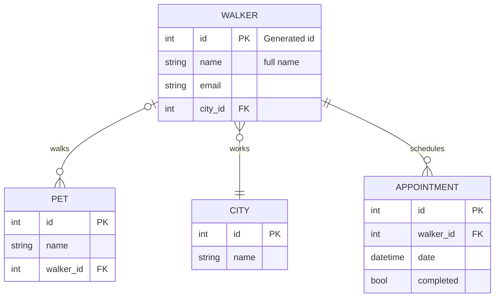

# deshawn-server

## Entity Relationship Diagram



## Lessons

### Models

- Use Models to define tables
- Django will automatically create the id field
- ```py
  from django.db import models  # Import base class from Django stdlib


  class City(models.Model):  # Must inherit from this base class
      name = models.CharField(max_length=155)  # Define all non-id fields
  ```

### Views

- Use a views to handle actions such as retrieve, list, create, update, and delete
- ```py
  class AppointmentView(ViewSet):

      def retrieve(self, request, pk=None):
          appointment = Appointment.objects.get(pk=pk)
          serialized = AppointmentSerializer(appointment, many=False)
          return Response(serialized.data, status=status.HTTP_200_OK)

      def list(self, request):
          appointments = Appointment.objects.all()
          serialized = AppointmentSerializer(appointments, many=True)
          return Response(serialized.data, status=status.HTTP_200_OK)

      def create(self, request):
          # Get the related walker from the database using the request body value
          client_walker_id = request.data["walkerId"]
          walker_instance = Walker.objects.get(pk=client_walker_id)

          # Create a new appointment instance
          appointment = Appointment()

          # Use Walker instance as the value of the model property
          appointment.walker = walker_instance

          # Assign the appointment date using the request body value
          appointment.date = request.data["appointmentDate"]

          # Performs the INSERT statement into the deshawnapi_appontment table
          appointment.save()

          # Serialization will be covered in the next chapter
          serialized = AppointmentSerializer(appointment, many=False)

          # Respond with the newly created appointment in JSON format with a 201 status code
          return Response(serialized.data, status=status.HTTP_201_CREATED)
  ```
