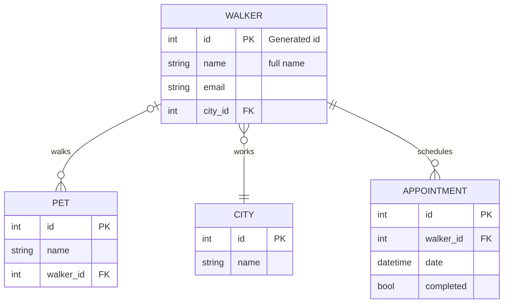

# deshawn-server

## Entity Relationship Diagram

```mermaid
erDiagram
    WALKER |o--o{ PET : walks
    WALKER }o--|| CITY : works
    WALKER ||--o{ APPOINTMENT : schedules
    WALKER {
        int id PK "Generated id"
        string name "full name"
        string email
        int city_id FK
    }
    PET {
        int id PK
        string name
        int walker_id FK
    }
    CITY {
        int id PK
        string name
    }
    APPOINTMENT {
        int id PK
        int walker_id FK
        datetime date
        bool completed
    }
```
